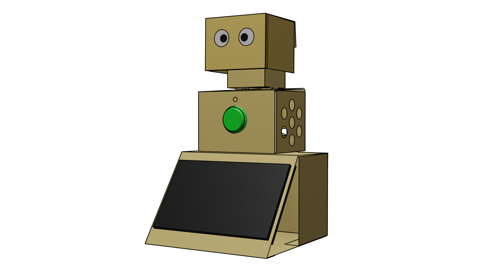
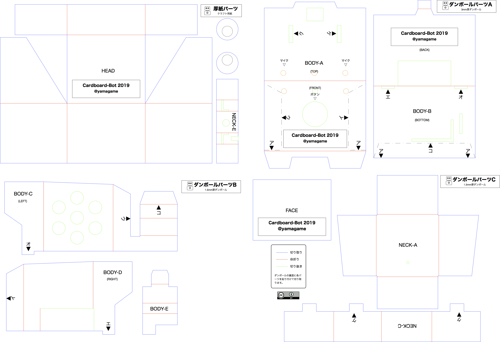
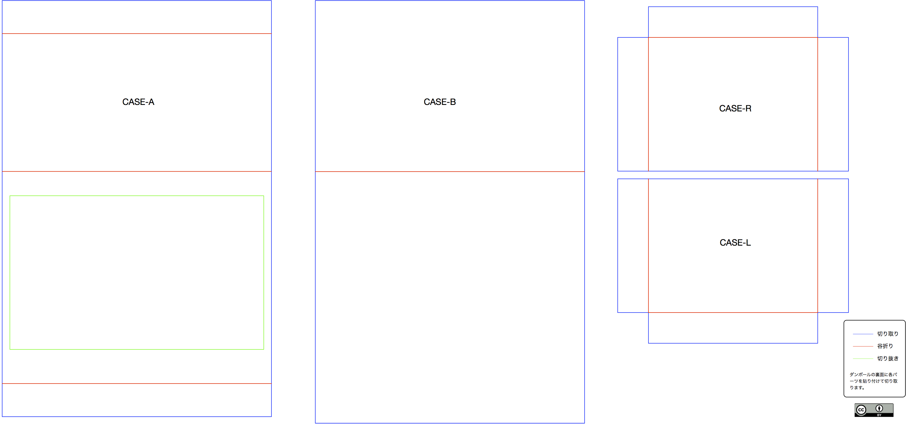

# cardboard-bot-parts

コミュニケーションダンボールロボの設計図です。

## roboparts.pdf

## roboparts.pdf

## 組み立て方法

以下のリンクを参照

[ダンボールロボ組立説明書（ダンボール部品の組み立て）](https://docs.google.com/presentation/d/1UpWU1XwPd8BRjycb6YPOOZsnTe_TST_uFU3-P5D1xNc/edit?usp=sharing)
